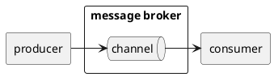
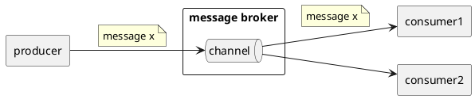
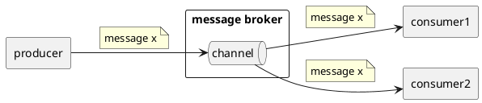
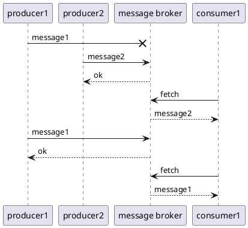
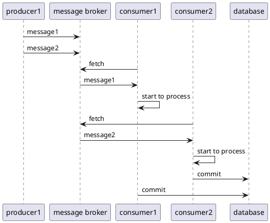
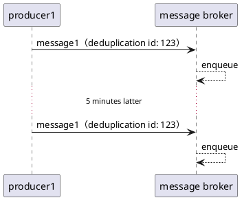
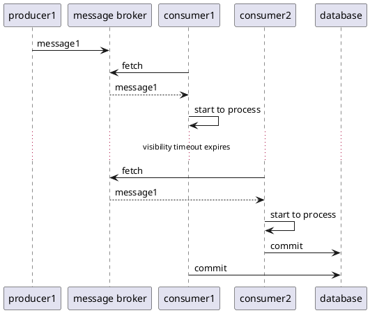
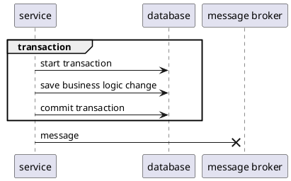
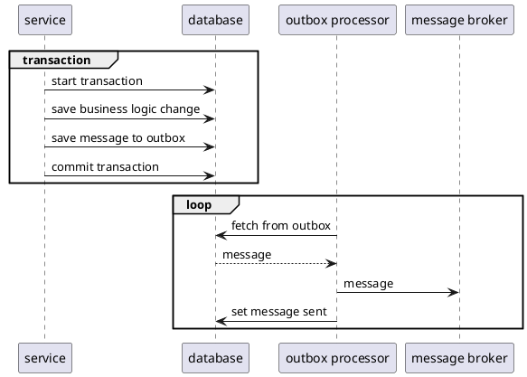

# 背景と目的

マイクロサービス間で非同期メッセージングを実現するために、いくつかメッセージブローカーとしての選択肢があります。例えばAWSのサービスだとSQS, Kinensis, MKSなどが挙げられます。

今回はSQSがサービス間の非同期メッセージングを実現するために利用できるかを調査した時の観点をまとめました。

# 概要

まず非同期メッセージングの概要を整理します。

## 非同期メッセージングの役割

ネットワークを介してプロセス間でメッセージを送受信するには、同期的な通信と非同期的な通信があります。

同期的な通信はクライアントがリクエストを発行し、レスポンスを待つという形式になります。

- リクエスト先のサービスが対応可能である必要がある
- レスポンスが返ってくるまでブロッキングされる
- すぐにリクエストが処理される
- リクエスト先のサービスの呼び出し方を知る必要がある

非同期的な通信はプロデューサー（あるいはパブリッシャー、センダー）がメッセージを生成し、複数のコンシューマー（あるいはサブスクライバー、レシーバー）が消費する形式になります。

通常、メッセージブローカーがメッセージをバッファリングし、プロデューサーに送信され、コンシューマーから読み取られます。プロデューサーはメッセージブローカーに送信するだけで済むので、コンシューマーによってブロックされません。そして、SQSもメッセージブローカーの一つです。

- メッセージがバッファリングされる
  - メッセージブローカーが対応可能である必要がある
  - 送信時にコンシューマーが対応可能でなくて良い
  - 受信時にプロデューサーが対応可能でなくて良い
- プロデューサーは送信後にブロッキングされない
- 送信からメッセージが処理されるまでタイムラグが発生する
- プロデューサーはメッセージブローカーの呼び出し方を知る必要がある

同期的・非同期的な通信の特徴を比較するとそれぞれ使い分けができます。

- 同期通信を使うべき場合
  - メッセージブローカーよりリクエスト先のサービスの方が可用性が高い
  - リクエストから即時処理をする必要がある
  - リクエスト先のサービスのAPIに依存できる（サービスディスカバリが容易でインターフェースが変わりにくい）
- 非同期通信を使うべき場合
  - リクエスト先のサービスよりメッセージブローカーの方が可用性が高い
  - 送信後にブロックさせたくない
  - 送信時と処理のタイムラグが許容できる
  - 複数のサービスがメッセージを利用したり、呼び出し方が変更される可能性がある

## チャンネルとコンシューマーの関係

メッセージブローカーの中ではメッセージはチャンネル（SQSの場合はキュー）ごとにバッファリングされます。チャンネルには以下の二種類があります。

- ポイントツーポイント（point-to-point）
- パブリッシュ・サブスクライブ（publish-subscribe）

### ポイントツーポイント

ポイントツーポイントチャンネルは複数のコンシューマーの内一つだけがメッセージを受信させます。つまり、一つのコンシューマーが受信するとそのメッセージは他のコンシューマーから見えなくなります。

またロードバランシングとも呼ばれます。このような仕組みによって複数のコンシューマーでそれぞれのメッセージを処理する作業を並列化することができます。

SQSのキューもポイントツーポイントチャンネルで、コンシューマーが受信するとメッセージが削除されるか、指定時間を越えるまで他のコンシューマーから受信されなくなります。
c.f. [VisibilityTimeout](https://docs.aws.amazon.com/ja_jp/AWSSimpleQueueService/latest/SQSDeveloperGuide/sqs-visibility-timeout.html)

### パブリッシュ・サブスクライブ

パブリッシュ・サブスクライブチャンネルは対象の全てのコンシューマーにメッセージを配信します。つまり一つのメッセージが送信されるとそれぞれのコンシューマーに対してメッセージのコピーが配信されます。

また、ファンアウトとも呼ばれます。このような仕組みによって複数のコンシューマーが互いに影響し合うことなく同じメッセージを扱うことができます。

SNSでメッセージの通知先と複数のSQSのキューを対応づけることで、プロデューサーが一つのメッセージをSNSに送信しSQSをパブリッシュ・サブスクライブのように利用することができます。
c.f. [キューへのファンアウト](https://docs.aws.amazon.com/ja_jp/sns/latest/dg/sns-sqs-as-subscriber.html)

# メッセージの順序保証

非同期メッセージングを導入する際に、メッセージの送信時の順序がチャンネルで保証されるか考慮する必要があります。

SQSはFIFO（先入れ先出し）キューを提供しており、メッセージの受信される順序が送信された順序と一致するように保証されます。
c.f. [FIFOキュー](https://docs.aws.amazon.com/ja_jp/AWSSimpleQueueService/latest/SQSDeveloperGuide/FIFO-queues.html)

ちなみにFIFOはファイフォ（`ˈfaɪ.foʊ`）と呼ぶようです。
c.f. https://en.wiktionary.org/wiki/FIFO#English

しかし、**チャンネルのメッセージの保証されていたとしても、必ずシステム全体でFIFOが保証されるわけではない**ので注意が必要です。
システム全体でメッセージの送受信の順序を担保するには以下の制約を課す必要があるためです。

1 チャンネルにおけるプロデューサーに関する制限
- シングルスレッドのプロデューサーのみに制限する
- もしくはプロデューサー間で送信する順番を制御する

2 チャンネルにおけるコンシューマーに関する制限
- シングルスレッドのコンシューマーのみにする
- もしくはコンシューマー間で処理する順番を制御する

c.f. [Dissecting SQS FIFO Queues — Does Ordered and Exactly Once Messaging Really Exist?](https://sookocheff.com/post/messaging/dissecting-sqs-fifo-queues/)

## チャンネルにおけるプロデューサーに関する制限

まずチャンネルに送信するプロデューサーが複数あり、一つのプロデューサーがチャンネルへ送信失敗した場合を考えます。

上の図はプロデューサーがメッセージ１（一番目のメッセージ）の送信に失敗し、別のプロデューサーがメッセージ２（二番目のメッセージ）が次に送信に成功した場合を表しています。

この場合、メッセージの順序を保証するにはプロデューサー間で送信の順番を制御して順序を保って送信できるようにする必要があります。この例だとプロデューサー1がメッセージ１を送信するまでプロデューサー2はメッセージ２の送信を待つ必要があります。もしくはプロデューサー自体を一つのスレッドのみに制限する必要があります。

他には、メッセージ自体に順序を表す情報（タイムスタンプや、シーケンス番号など）を持たせ、コンシューマー側で調整することが可能な場合もあります。

## チャンネルにおけるコンシューマーに関する制限

次にチャンネルから受け取るコンシューマーが複数ある場合を考えます。

上の図はあるコンシューマーがメッセージ１を処理中に別のコンシューマーがメッセージ２を先に処理し終えた場合を表します。

この場合、メッセージを順序通りに処理してデータベースにコミットするにはコンシューマー間で処理の順番を制御する必要があります。この例だとコンシューマー1がメッセージ１をコミットし終えるまでコンシューマー2はメッセージ２の処理を待つ必要があります。もしくはコンシューマー自体を一つのスレッドのみに制限する必要があります。

以上のことからメッセージの順序が保証されなくてもシステム全体で不整合が起きないように設計できる場合は、そうするに越したことはありません。

# メッセージの重複

次にメッセージが重複されて処理される場合について考えます。

メッセージが少なくとも一つのコンシューマーへ配送される保証をat-least-onceと呼びます。この場合は、同じメッセージが重複して渡される可能性を排除しません。
一方、メッセージは重複せず必ず一回だけ渡されることをexactly-onceと呼びます。

## メッセージの重複が起こる場合

現状、大抵のメッセージブローカーはat-least-onceを保証しています。
しかし以下の場合があるため、**チャンネルがexactly-onceだったとしてもシステム全体でexactly-onceとは限りません**。

1. 同じメッセージをプロデューサー側で重複して送信した場合
2. 同じメッセージをコンシューマー側で重複して受信した場合

### プロデューサー側が重複してメッセージを送信

SQSのFIFOキューはメッセージの重複排除もサポートしています。
これはメッセージが送信されてから約5分以内に同じメッセージIDを待つメッセージが送信されるとFIFOキューが破棄するためです。

[Amazon SQS FIFO (先入れ先出し) キュー](https://docs.aws.amazon.com/ja_jp/AWSSimpleQueueService/latest/SQSDeveloperGuide/FIFO-queues.html)
> FIFO キューは、重複をキューに送信することを防止するのに役立ちます。5 分間の重複排除間隔内に SendMessage アクションを再試行しても、Amazon SQS ではキューに重複を挿入しません。

しかし、最初のメッセージの送信から5分経過してから重複したメッセージを送った場合はexactly-onceになりません。

### コンシューマー側が重複してメッセージを受信

またコンシューマー側が重複してメッセージを受信する場合もあります。

SQSの場合はメッセージを受信しても自動的に削除しません。処理が終わり次第、削除のAPIをコンシューマーが呼び出す必要があります。その場合、コンシューマーが処理している間に別のコンシューマーが受信する可能性があるので、VisibilityTimeoutでそれを防ぎます。VisibilityTimeoutはメッセージが受信されてから一定時間が経つまで他のコンシューマーが受信できなくなる設定です。

[Amazon SQS 可視性タイムアウト](https://docs.aws.amazon.com/ja_jp/AWSSimpleQueueService/latest/SQSDeveloperGuide/sqs-visibility-timeout.html)
> メッセージが受信された直後は、メッセージはキューに残ったままです。他のコンシューマーが同じメッセージを再処理しないように、Amazon SQS は可視性タイムアウトを設定しています。Amazon SQS では、この時間内に他のコンシューマーが同じメッセージを受信したり処理したりすることはできません。

しかし、処理時間が設定より長い場合や処理が終わり結果がコミットされた後に削除のAPI呼び出しに失敗した場合などがあるとVisibilityTimeoutの超過が起こります。

上の図はコンシューマーが処理に時間がかかりVisibilityTimeoutを過ぎたため、他のコンシューマーが同じメッセージを受信してしまう場合を表します。

## メッセージの重複への対処

これまで確認したようにメッセージが重複する可能性がある以上それが起こってもコンシューマー側で対処できるようにする必要があります。実際の手段としては以下の二つがあります。

1. 冪等な処理にする
2. メッセージの重複を確認し二回目以降の処理を行わない

冪等とは一回目の実行結果と二回目以降の実行の結果が変わらない性質のことです。

またメッセージの重複確認はコンシューマー側で処理済みのメッセージを永続化しておき実行前に確認するなどの手段が考えられます。

c.f. [Pattern: Idempotent Consume](https://microservices.io/patterns/communication-style/idempotent-consumer.html)

# メッセージの喪失

次にメッセージが途中で失われて本来行われるべき処理がされなくなる場合を考えます。

## メッセージの送信失敗への対処

まずアプリケーションがプロデューサー経由でのメッセージの送信に失敗し、失われる場合を考えます。

通常メッセージは送信側のアプリケーションでデータの作成や変更を伴った結果、発生します。例えば従業員が事業所に招待（作成）された結果、その従業員へメールをメッセージブローカー経由で送信する場合などです。その場合、従業員レコードを挿入しコミットした後に、メッセージを送信することになります。

しかし、上の図のようにコミットして送信前にアプリケーションがクラッシュする場合やメッセージブローカーが受信できない場合が考えられます。そうなるとメッセージを伴う操作はコミットされているにも関わらずメッセージは失われます。

#### outbox pattern

送信時のメッセージの喪失への対策の一つとしてoutbox patternがあります。
c.f. [The Outbox Pattern](http://www.kamilgrzybek.com/design/the-outbox-pattern/)

これはメッセージを伴う処理とメッセージの永続化を同一のトランザクションで行い、別のプロセスがプロデューサーとしてメッセージブローカーへ送信する方法です。

メッセージはアプリケーションと同じデータストアの別テーブル（outbox）などで管理され、メッセージを伴う処理とメッセージの永続化の対応関係が保証されます。

このプロデューサーはoutboxから送信未完了のメッセージを読み取り、送信に失敗してもリトライします。そして送信に成功した場合は対応するoutboxのレコードのステータスを処理済みにするか、それ自体を削除します。

outboxからメッセージを読み取るには、アプリケーション側でポーリングするかトランザクションログを読み取るCDC（Change Data Capture）を利用するかなどの方法があります。

## メッセージの受信失敗への対処   

またコンシューマー側で受信に失敗する場合も考えられます。まず受信の失敗を場合分けして考えます。

1 そもそもメッセージを受け取れない
- ブローカーがレスポンスを返せない（クラウドサービス側の障害など）
- コンシューマーがリクエストできない（リソースの逼迫によるプロセスの突然死など）

2 受け取ったメッセージを処理するとエラーになりコミットできない
- メッセージのフォーマットが不正などアプリケーション側のバグ

SQSの場合は削除されないまま残っているメッセージは自動的に削除されます。
設定により14日間まで保持期間を延長できますが、それまでに受信して処理する必要があります。

[基本的な Amazon SQS アーキテクチャ](https://docs.aws.amazon.com/ja_jp/AWSSimpleQueueService/latest/SQSDeveloperGuide/sqs-basic-architecture.html)
> Amazon SQS は最長メッセージ保持期間を超えてキューに残っているメッセージを自動的に削除します。

### 上限付きのリトライ

1のケースは一時的な負荷やクラウドサービスの障害が起因するので、14日以上それが続くことは考えにくく、プロセスの再起動やリトライで十分対応できそうです。しかし2のケースで何度リトライしても成功しない場合もあるのでリトライ回数には上限を設ける必要があります。

またexponential backoffやjitterというアルゴリズムを使ってリトライが特定のタイミングで集中しないような方法もあります。
c.f. https://aws.typepad.com/sajp/2015/03/backoff.html

### リトライが上限を超えた場合の対応 

2のケースは確かにリトライするだけでは解決できません。

その場合に備えて何度もリトライで失敗になったメッセージの通知と、開発者側での実装の修正が必要になります。そして修正後プロデューサー側のoutboxから再送するなどして、コンシューマー側で同じメッセージをもとに再実行させる必要があります。

# メッセージの配送遅延

リクエスト後即時処理を開始したい場合は非同期メッセージングを利用すべきではありません。

しかし、要件によってメッセージが処理されるまでの時間をどの程度許容できるかが変わってきます。そこで遅延が何がボトルネックになって起こるのかは把握しておく必要があります。

メッセージの処理までの時間に影響を与える要因に関しては以下が考えられます。

1. メッセージブローカーへの送信・受信リクエストのレイテンシー（リクエストからレスポンスまでの時間）
2. プロデューサーがメッセージを送信するまでの時間（送信待ち時間）
3. コンシューマーがメッセージを受信するまでの時間（受信待ち時間）

SQSに関しては送信、受信、削除のAPIのレイテンシーは数十ミリ秒から数百ミリ秒なので1は2, 3と比べて優先度は低いです。

https://aws.amazon.com/jp/sqs/faqs/
> Q: Amazon SQS のレイテンシーは通常どれくらいですか?
> SendMessage、ReceiveMessage、DeleteMessage の各 API リクエストの場合、レイテンシーは通常数十ミリ秒～数百ミリ秒です。

2のoutboxにメッセージが挿入されてから送信されるまでの時間は、送信の仕方によります。
アプリケーション側でoutboxから未送信のメッセージをポーリングする場合は、スレッドの数、ポーリング間隔、クエリの実行時間が影響を与えます。

ポーリング間隔が小さいとその分、送信対象のレコードをすぐに取得することができますが、データベースへの読み取り頻度が増えます。このトレードオフを適切に設定することが難しく遅延が看過できない場合は、トランザクションログをトリガーにした送信の方がパフォーマンスが高くなる可能性があります。
c.f. https://debezium.io/blog/2018/07/19/advantages-of-log-based-change-data-capture/

3のメッセージの受信待ち時間に関しては、受信頻度、一回あたりのメッセージ数、スレッドの数などが影響を与えます。

SQSではメッセージは複数のサーバーで冗長化されています。そしてロングポーリングを利用することでタイムアウトしない限りで最大受信数まで全サーバーを調べることができます。したがって一回あたりの取得件数を上げることができます。
c.f. [Amazon SQS ショートポーリングとロングポーリング](https://docs.aws.amazon.com/ja_jp/AWSSimpleQueueService/latest/SQSDeveloperGuide/sqs-short-and-long-polling.html)

またSQSでは滞留を示すメトリクス（ApproximateNumberOfMessagesなど）に応じてコンシューマーをスケーリングさせることもできます。
c.f. [Amazon SQSに基づくスケーリング](https://docs.aws.amazon.com/ja_jp/autoscaling/ec2/userguide/as-using-sqs-queue.html)

